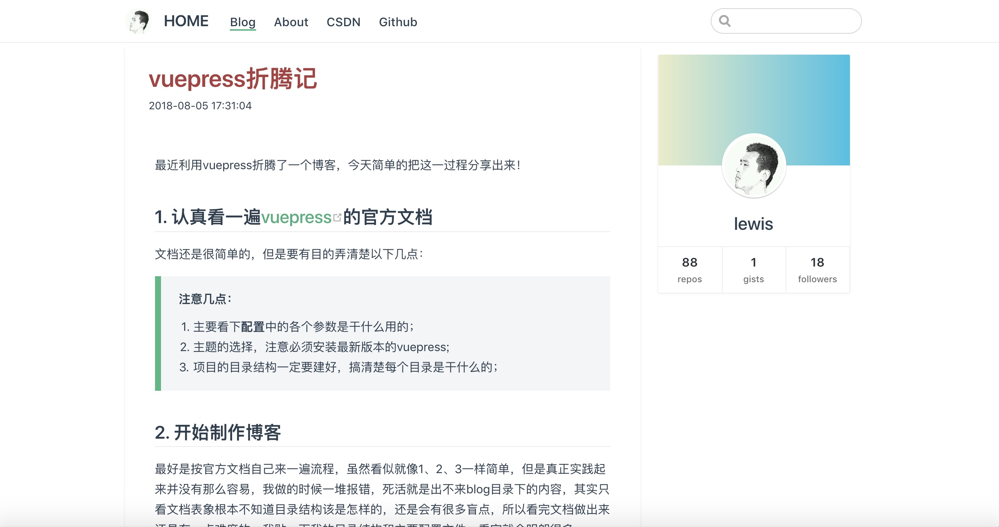

最近利用vuepress折腾了一个博客，今天简单的把这一过程分享出来！
<!-- more -->
## 1. 认真看一遍[vuepress](https://vuepress.vuejs.org/zh/)的官方文档
文档还是很简单的，但是要有目的弄清楚以下几点：
::: tip 注意几点：
1. 主要看下**配置**中的各个参数是干什么用的；
2. 主题的选择，注意必须安装最新版本的vuepress;
3. 项目的目录结构一定要建好，搞清楚每个目录是干什么的；
:::

## 2. 开始制作博客
最好是按官方文档自己来一遍流程，虽然看似就像1、2、3一样简单，但是真正实践起来并没有那么容易，我做的时候一堆报错，死活就是出不来blog目录下的内容，其实只看文档表象根本不知道目录结构该是怎样的，还是会有很多盲点，所以看完文档做出来还是有一点难度的，我贴一下我的目录结构和主要配置文件，看完就会明朗很多。
### 基本配置config.js
```
module.exports = {
	theme: 'yubisaki',
	title: 'HOME', 
	description: `lewis's blog`,
	head: [
		['link', { rel: 'icon', href: `/favicon.ico` }]
	],
	base: '/blog/',
	repo: 'https://github.com/lewiscutey/blog',
	dest: './docs/.vuepress/dist',
	ga: '',
	serviceWorker: true,
	evergreen: true,
	themeConfig: {
		background: `/img/`,
		github: 'lewiscutey',
		logo: '/img/logo.png',
		accentColor: '#ac3e40',
		per_page: 6,
		date_format: 'yyyy-MM-dd HH:mm:ss',
		nav: [
			{text: 'Blog', link: '/blog/'},
			{text: 'About', link: '/about/'},
			{text: 'CSDN', link: 'http://www.cnblogs.com/lewiscutey/'},
			{text: 'Github', link: 'https://github.com/lewiscutey'}
		]
	},
	markdown: {
		anchor: {
			permalink: true
		},
		toc: {
			includeLevel: [1, 2]
		},
		config: md => {
			// 使用更多 markdown-it 插件！
			md.use(require('markdown-it-task-lists'))
			.use(require('markdown-it-imsize'), { autofill: true })
		}
	},
	postcss: {
		plugins: [require('autoprefixer')]
	},
}
```
### 目录结构
```
docs
├─ README.md          // 博客首页配置
├─ index.md           // 必须是空的，用来生成目录结构
├─ about/             // nav导航的目录about模块
│  ├─ index.md        // 直接写关于我的内容
├─ blog/              // nav导航的目录blog模块，写文章的主体内容
│  ├─ index.md        // 必须是空的，用来生成文章列表
│  ├─ one.md          // 文章内容一
│  └─ two.md          // 文章内容二
└─ .vuepress/         // vuepress配置文件夹
   ├─ dist            // 不需要自己创建，用来存放build之后的东西
   ├─ public/         // 用来放置一些静态资源
   │  ├─ img/         // 用来存放图片
   │  ├─ favicon.ico  // 博客的logo
   └─ config.js       // 基本配置信息
```

::: warning 注意：
目录结构比较重要，最好按照这个来配置，尤其是想要生成文章列表的时候，必须在nav主目录下放置一个空的index.md文件用来生成列表，还有就是base的配置注意一下，如果是GitHub的主页就没必要配置这个了，最好按着推荐的这种目录结构来配置，不然就会出现很多不尽人意的bug，哈哈。
:::
## 3. 选择一款漂亮的主题
我采用的是vuepress-theme-yubisak这个主题，简洁不失大气，美观不失内涵，请自行下载最新的版本使用，这个主题目前并不完善，后期会加入标签分类、评论等模块，努力做到一个更加完美的博客系统，欢迎[PR](https://github.com/Bloss/vuepress-theme-yubisaki/pulls)，有问题也可以随时[issue](https://github.com/Bloss/vuepress-theme-yubisaki/issues)，当然后期有时间也会做一些精美的主题来随意选择。
::: tip vuepress-theme-yubisak主题使用
vuepress-theme-yubisak具体使用情况可以看[这篇文章](https://wuwaki.me/yubisaki/usage.html)的介绍，推荐使用yarn，npm也尽量使用5+的版本，不然lock文件会带来更新时的一些问题,如果想自动开发、部署推荐全局安装[yubisaki-shell](https://github.com/Bloss/yubisaki-shell)。
:::
## 4. 一键生成博客系统
::: warning 福利：
如果看完上面的介绍还是一脸懵逼，自己实践下来一番还是各种报错，别慌，没关系的；不管你是C，还是Java，不管你是go,还是PHP，用我这个工具都可以一键生成自己的博客了，只需要安装一下[vuepress-init](https://www.npmjs.com/package/vuepress-init)这个npm module即可,前提是你的电脑装了node的环境，可以正常的使用npm就好，如果连node环境都搞不定，那也OK可以私聊，哈哈。从此只需关注输入内容就可以，因为能做的都帮你做好了。
:::
### 如何使用？
> 1. 全局安装**vuepress-init**
```
npm i vuepress-init -g
```
> 2. 执行命令**vuepress init**创建项目，也可以执行**vuepress**查看命令
```
vuepress init
```
> 3. 进入刚创建的项目（不创建新的默认是当前目录），并安装所需依赖
```
cd <your project> && npm install
```
> 4. 执行命令**npm run dev**，会在本地起一个网络服务，可以直接查看效果
```
npm run dev
```
> 5. 执行命令**npm run new**会创建一个md文档，需安装[yubisaki-shell](https://github.com/Bloss/yubisaki-shell)
```
npm run new -- <blog name>.md
```
> 2. 执行命令**npm run deploy**一键部署在你的服务上，需提前设置好deploy.sh中自己的服务提交地址，默认是GitHub中的gh-pages分支
```
npm run deploy
```
## 5. 最终效果
#### 首页如下图：

#### 博客内容如下图：

## 致谢
这是使用本博客系统写的第一篇博客，感谢阅读！